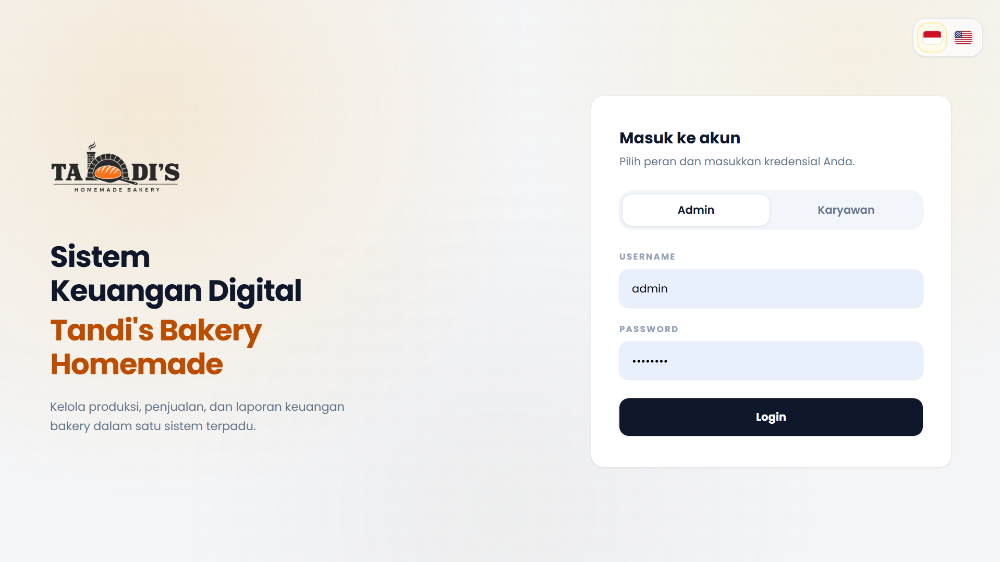
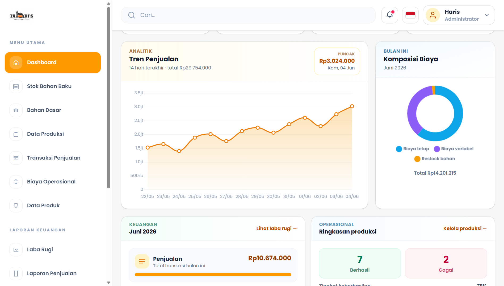
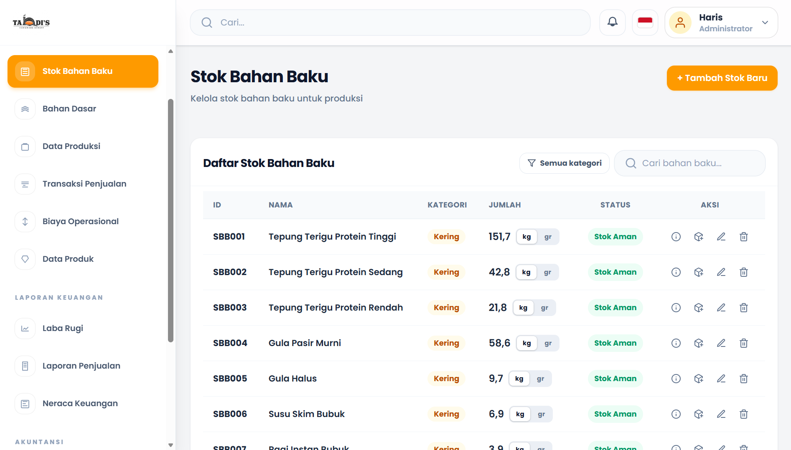
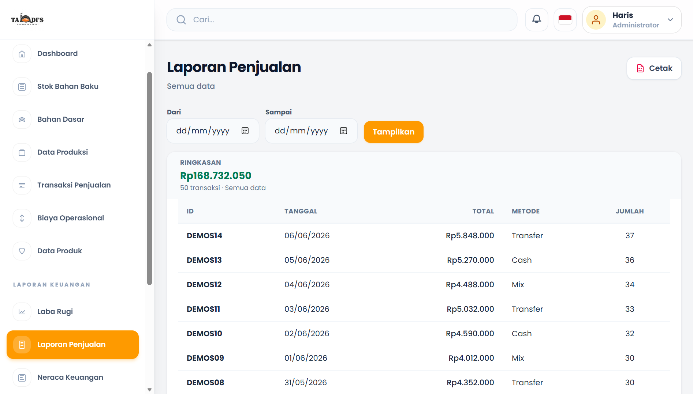

# Sistem Manajemen Keuangan Tandi's Bakery Homemade

## Deskripsi
Sistem Manajemen Keuangan Tandi's Bakery Homemade merupakan aplikasi berbasis web yang dikembangkan untuk membantu Tandi's Bakery Homemade dalam mengelola transaksi keuangan dan menyusun laporan laba rugi secara otomatis. Sistem ini bertujuan meningkatkan efisiensi pencatatan keuangan serta mempermudah proses pengambilan keputusan bisnis.

## Fitur Utama
- Login & Autentikasi Pengguna
- Dashboard
- Pencatatan Transaksi
- Pencatatan Stok Bahan Baku
- Perhitungan Laba Rugi 
- Laporan Keuangan
- CRUD Data

## Teknologi
- Laravel
- PHP
- HTML
- CSS
- JavaScript
- MySQL
  
## Peran
Project Manager dan System Analyst

## Tampilan Aplikasi
### Login

### Dashboard

### Stok Bahan Baku

### Laporan Penjualan

